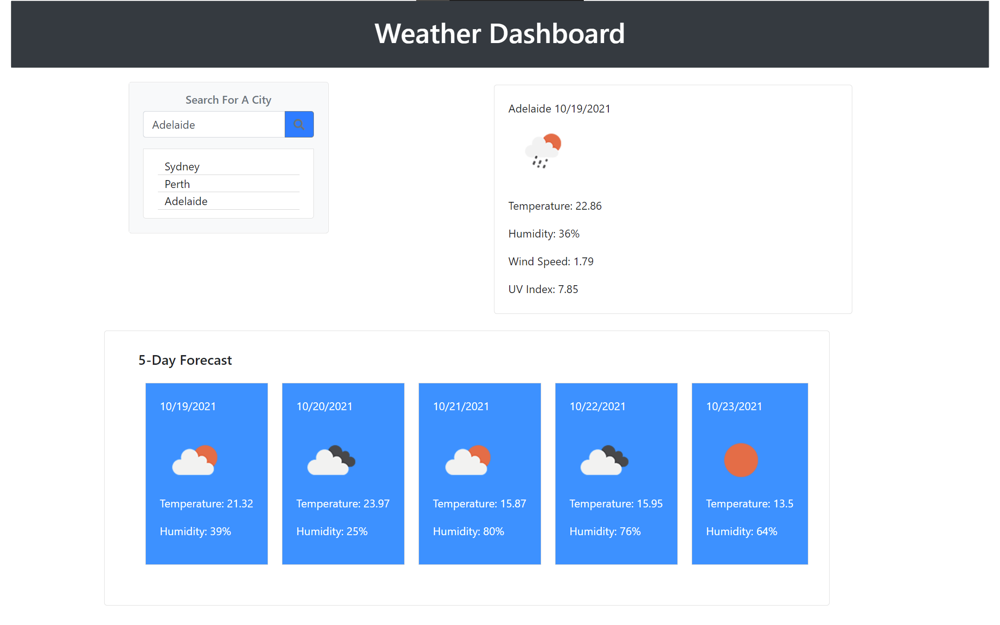

# Weather Dashboard API

This project is a weather dashboard and was developed for a homework assignment for Adelaide University fullstack flex bootcamp.

This weather dashboard utilizes HTML, CSS, Javascript and external sources such as bootstrap, moment.js, jquery and an external weather API to display a working weather dashboard that can save searches using local storage.

This project has been deployed to GitHub Pages. To get this project up and running, you can follow the deployment link. Or, download the sources files to use this as a template.

* [GitHub Repository](https://github.com/JCONSTANT112/Weather-Dashboard-API)
* [Deployed GitHub IO](https://jconstant112.github.io/Weather-Dashboard-API//)

# Project screenshot

# Prerequisites

To install this application, you will need a text editor. such as Visual Studio Code. 

# Installing

To install this code, download the zip file, or use GitHub's guidelines to clone the repository. Then simply open in preferred browser.

# Summary
* HTML and CSS, Javascript documents along with external sources create a weather dashboard that allows you to search cities current weather and also a 5 day forecast.
* This project emphasizes the use of using an external API to pull up to date weather data about any city tracked by the API.
* When a city is searched for it is saved to local storage.

# This project has the following features 
    Search function for looking at a particular cities current and future weather(up to 5 days).
    * Search history is saved via local storage.
    * Then the user is presented with the current weather and 5 days of future weather in an easy to view card layout.
    * Icons representing the current state of the weather such as clouds/ rain or sun are displayed as well the temperature and humidity.
    
    

# Authors
 Jacob Constantinidis 

# Acknowledgements
Adelaide University full stack flex bootcamp for providing project parameters and guides.